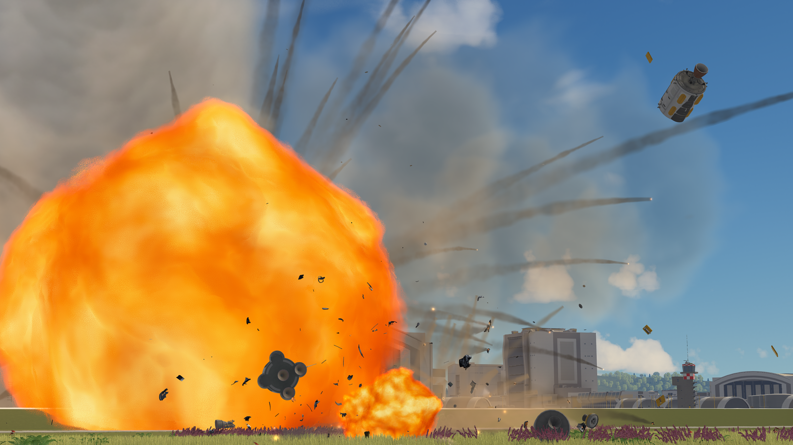
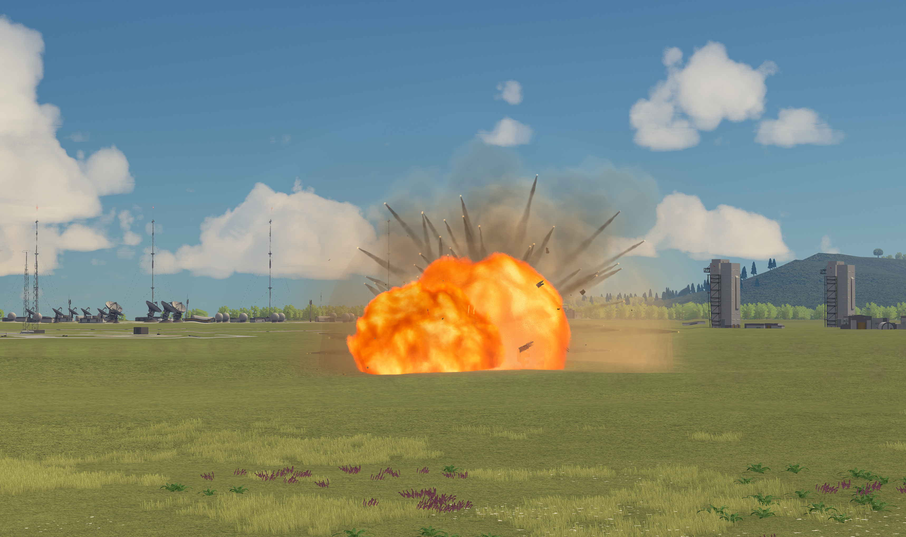
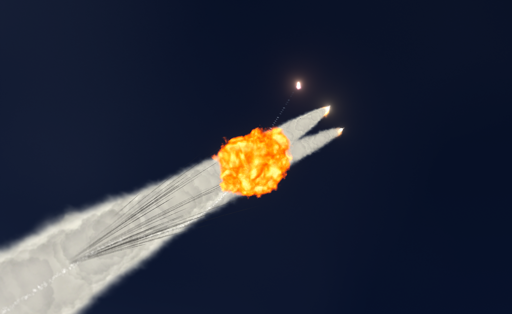
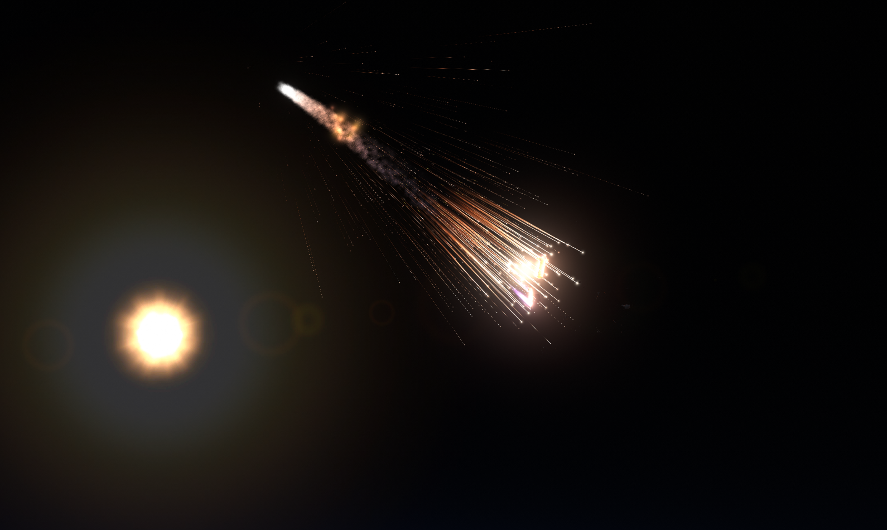
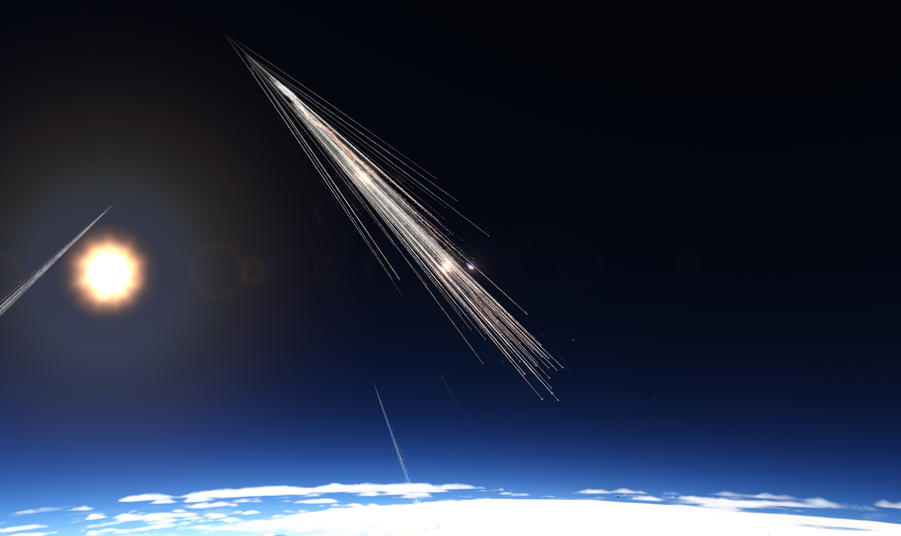
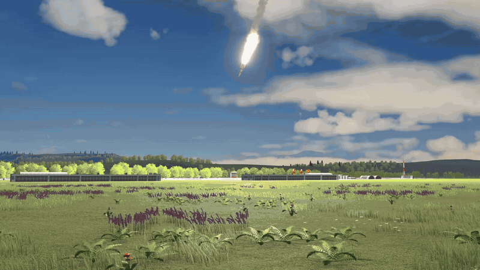

# Volumetric Explosion FX (VEFX) — v1.0

Fireballs, smoke, visual debris, ground fires and water impacts for **KSP 1.12.5**.
Visual effects only: gameplay and physics are unchanged.
The interface follows the language selected in KSP.
Windows is supported for this release; macOS and Linux are not validated.
Quality defaults to Ultra and can be reduced from the toolbar.

## Screenshots

## In game

## Installation

1. Close KSP.
2. Copy the package's `VolumetricExplosionFX` folder into `GameData`.
3. Launch KSP and use the flame toolbar button to adjust the effects.

To uninstall, remove `GameData/VolumetricExplosionFX`.

[Compatibility](docs/COMPATIBILITY.md) · [Build from source](docs/BUILD.md)

## License

[MIT](LICENSE). Copyright (c) 2026 Warnix.
